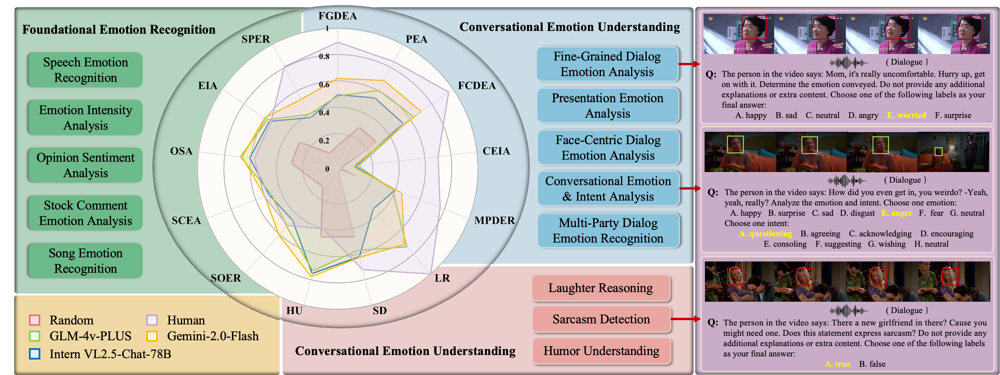

# EmoBench-M

<p align="center">
  
</p>

<p align="center">
    <a href="https://emo-gml.github.io/"></a>
    <a href="https://arxiv.org/abs/2502.04424"></a>
    <a href="https://drive.google.com/file/d/1ohQWGJOuJVN3-uOeEifA3C0tMaadYe_K/view?usp=sharing"></a>
    <a href="https://opensource.org/licenses/Apache-2.0"> </a>

</p>

<p align="center">
    <a href="#-about">🌸 About</a> •
    <a href="#-news">📰 News</a> •
    <a href="#-dataset">📦 Dataset</a> •
    <a href="#-quick-start">🔥 Quick Start</a> •
    <a href="#-citation">📜 Citation</a>
</p>

## 🌸 About
This repository contains the official evaluation code and data for the paper "**EmoBench-M: Benchmarking Emotional Intelligence for Multimodal Large Language Models**". See more details in our [paper](https://arxiv.org/pdf/2502.04424).

> Can Multimodal Large Language Models (MLLMs) understand human emotions in dynamic, multimodal settings? To address this question, we introduce <b>EmoBench-M</b>, a comprehensive benchmark grounded in psychological theories of Emotional Intelligence (EI), designed to evaluate the EI capabilities of MLLMs across video, audio, and text. <b>EmoBench-M</b> spans 13 diverse scenarios across three key dimensions of EI: Foundational Emotion Recognition, Conversational Emotion Understanding, and Socially Complex Emotion Analysis. It includes over 5000 carefully curated samples and both classification and generation tasks, covering a wide range of real-world affective contexts. Through extensive evaluations of state-of-the-art MLLMs—including open-source models like Qwen2.5-VL and InternVL2.5, and proprietary models such as Gemini 2.0 Flash—we find that (i) current MLLMs significantly lag behind human performance, especially in conversational and socially complex tasks; (ii) model size alone does not guarantee better emotional reasoning; and (iii) nuanced social emotions and intent understanding remain particularly challenging. We hope EmoBench-M provides a solid foundation for future research toward emotionally intelligent AI systems.



## 📰 News
- **[2025-07-08]** We open-sourced the code and dataset for EmoBench-M on GitHub!
- **[2025-02-06]** Paper submitted to arXiv: https://arxiv.org/abs/2502.04424.
- **[2025-02-05]** Created the official project website: https://emo-gml.github.io/.

## 🏆 Leaderboard

| Method                             |   FER   |   CEU   |  SCEA   |  Avg.   |
|------------------------------------|---------|---------|---------|---------|
| **Human**                         | 62.0 | 84.4 | 72.7 | 73.0 |
| 🏅Gemini-2.0-Flash                 | **61.4** |  53.4   | 72.0 | **62.3** |
| 🥈Gemini-1.5-Flash                 |  59.7   | **55.6** |  68.6   |  61.3   |
|🥉Gemini-2.0-Flash-Thinking          |  57.7   |  54.2   |  70.0   |  60.6   |
| Qwen2.5-VL-78B-Instruct            |  53.0   |  47.9   | **72.5** |  57.8   |
| GLM-4V-PLUS                        |  56.1   |  47.3   |  69.6   |  57.7   |
| InternVL2.5-38B                    |  57.6   |  48.9   |  56.6   |  54.4   |
| Qwen2-Audio-7B-Instruct            |  59.9   |  43.3   |  55.7   |  53.0   |
| InternVL2.5-78B                    |  53.0   |  44.5   |  59.8   |  52.4   |
| Video-LLaMA2.1-7B-16F              |  50.9   |  46.1   |  57.5   |  51.5   |
| InternVideo2-Chat-8B              |  50.6   |  40.2   |  63.6   |  51.5   |
| Video-LLaMA2-7B-16F                |  51.4   |  37.1   |  64.5   |  51.0   |
| InternVL2.5-4B                     |  54.5   |  49.3   |  49.0   |  50.9   |
| InternVL2.5-8B                     |  51.2   |  45.7   |  54.2   |  50.4   |
| Video-LLaMA2.1-7B-AV               |  50.4   |  46.1   |  49.5   |  48.7   |
| Video-LLaMA2-72B                   |  50.7   |  37.3   |  61.8   |  49.9   |
| Video-LLaMA2-7B                    |  45.4   |  34.5   |  61.3   |  47.1   |
| MiniCPM-V-2.6-8B                   |  40.0   |  43.1   |  56.5   |  46.5   |
| LongVA-DPO-7B                      |  45.7   |  32.1   |  53.5   |  43.8   |
| Emotion-LLaMA                      |  36.9   |  30.7   |  54.1   |  40.6   |
| 👀 Random                          |  23.1   |  19.8   |  33.3   |  25.4   |


## 📦 Dataset
To use this benchmark, **please first download the original video files and corresponding annotation `.json` files** from the link below:

<a href="https://drive.google.com/file/d/1ohQWGJOuJVN3-uOeEifA3C0tMaadYe_K/view?usp=sharing"></a>

Each JSON file contains conversation-style prompts and labels aligned with the corresponding video clips. The structure looks like:

  ```json
  [
    {
      "id": "0",
      "video": "videos/ch-simsv2s/aqgy4_0004/00023.mp4",
      "conversations": [
        {
          "from": "human",
          "value": "<video>\nThe person in video says: ... Determine the emotion conveyed..."
        },
        {
          "from": "gpt",
          "value": "negative"
        }
      ]
    }
  ]
  ```
  ### 📁 Dataset Structure
  ```bash
  EmoBench-M/
  ├── benchmark_json/           # JSON files containing metadata and annotations for each dataset
  │   ├── FGMSA_test_instruction.json    # Test instructions for the FGMSA dataset
  │   ├── MC-EIU-test_500.json           # 500-sample test set for the MC-EIU dataset
  │   ├── MELD_test_instruction.json     # Test instructions for the MELD dataset
  │   ├── MOSEI_test_500.json            # 500-sample test set for the MOSEI dataset
  │   ├── MOSI_test_500.json             # 500-sample test set for the MOSI dataset
  │   ├── MUSTARD_500.json               # 500-sample test set for the MUSTARD dataset
  │   ├── RAVDSS_song_500.json           # 500-sample test set for the RAVDSS song subset
  │   ├── RAVDSS_speech_500.json         # 500-sample test set for the RAVDSS speech subset
  │   ├── SIMS_test_500.json             # 500-sample test set for the SIMS dataset
  │   ├── ch-simsv2s_test_500.json       # 500-sample test set for the Chinese SIMS v2s dataset
  │   ├── funny_test_instruction.json    # Test instructions for the UR-FUNNY dataset
  │   ├── mer2023_test1_instruction.json # Test instructions for the MER2023 dataset
  │   └── smile_test_data.json           # Test data for the SMILE dataset
  └── dataset_500/              # Corresponding video files for each dataset
      ├── FGMSA_test_instruction/
      │   └── videos/
      │       └── FGMSA/        # Video files for the FGMSA dataset
      ├── MC-EIU-test_500/
      │   └── videos/
      │       └── MC-EIU/       # Video files for the MC-EIU dataset
      ├── MELD_test_instruction/
      │   └── videos/
      │       └── MELD/         # Video files for the MELD dataset
      ├── MOSEI_test_500/
      │   └── videos/
      │       └── MOSEI/        # Video files for the MOSEI dataset
      ├── MOSI_test_500/
      │   └── videos/
      │       └── MOSI/         # Video files for the MOSI dataset
      ├── MUSTARD_500/
      │   └── videos/
      │       └── MUSTARD/      # Video files for the MUSTARD dataset
      ├── RAVDSS_song_500/
      │   └── videos/
      │       └── RAVDSS/       # Video files for the RAVDSS song subset
      ├── RAVDSS_speech_500/
      │   └── videos/
      │       └── RAVDSS/       # Video files for the RAVDSS speech subset
      ├── SIMS_test_500/
      │   └── videos/
      │       └── SIMS/         # Video files for the SIMS dataset
      ├── ch-simsv2s_test_500/
      │   └── videos/
      │       └── ch-simsv2s/   # Video files for the Chinese SIMS v2s dataset
      ├── funny_test_instruction/
      │   └── videos/
      │       └── UR-FUNNY/     # Video files for the UR-FUNNY dataset
      ├── mer2023_test1_instruction/
      │   └── videos/
      │       └── MER2023/      # Video files for the MER2023 dataset
      └── smile_test_data/
          └── videos/
              └── SMILE/       # Video files for the SMILE dataset
  ```
  📂 Dtat Structure Overview
  - benchmark_json/: Contains JSON files with metadata and annotations for each dataset, including test instructions and sample information.
  - dataset_500/: Corresponding video files for each dataset, organized into subdirectories named after each dataset.

## 🔥 Quick Start
EmoBench-M encompasses three primary evaluation tasks: Classification, Joint Emotion + Intent, and Generation. Each dataset is associated with one of these tasks.

### 🧪 Evaluation Usage

#### Install Dependencies

```bash
pip install -r requirements.txt
```

#### 1. Classification
- **Task**: Classify videos into predefined emotional categories.
- **Command**:
  ```bash
  python eval.py classification --json results.json --output classification.json
  ```
- **Input JSON (e.g. results.json) Format**:
  ```json
  [
    {"video": "sample1.mp4", "expected_value": "positive", "predicted_value": "positive"},
    {"video": "sample2.mp4", "expected_value": "neutral", "predicted_value": "negative"}
  ]
  ```
- **Output Format**:
  ```json
  {
    "accuracy": 0.85,
    "precision": 0.84,
    "recall": 0.83,
    "f1_score": 0.83
  }
  ```
- **Applicable Datasets**: All datasets except MC-EIU-test_500.json and smile_test_data.json.
---

#### 2. Joint Emotion + Intent
- **Task**: Simultaneously predict the emotion and intent conveyed in a video.
- **Command**:
  ```bash
  python eval.py joint --json emotions.json --output joint.json
  ```
- **Input JSON (e.g. emotions.json) Format**:
  ```json
  [
    {
      "modal_path": "sample1.mp4",
      "expected_emotion": "happy",
      "predicted_emotion": "happy",
      "expected_intent": "encouraging",
      "predicted_intent": "encouraging"
    }
  ]
  ```
- **Output Format**:
  ```json
  {
    "joint_accuracy": 0.80,
    "joint_precision": 0.79,
    "joint_recall": 0.78,
    "joint_f1": 0.78,
    "total": 100
  }
  ```
- **Applicable Dataset**: MC-EIU-test_500.json.
---

#### 3. Generation
- **Task**: Generate a textual description of the video's content.
- **Command**:
  ```bash
  python eval.py generation --json gen.json --output generation.json
  ```
- **Input JSON (e.g. gen.json) Format**:
  ```json
  [
    {"video": "sample1.mp4", "prediction": "I am very happy", "reference": "I feel happy"}
  ]
  ```
- **Output Format**:
  ```json
  {
    "avg_bleu": 0.35,
    "avg_rouge": 0.42,
    "avg_bert": 0.75,
    "total": 100
  }
  ```
- **Applicable Dataset**: smile_test_data.json.
---

### Important Notes for Researchers and Developers
- **Input JSON Preparation**:
  
  Researchers and developers need to write scripts tailored to their trained or tested models to generate the aforementioned input JSON files (results.json, emotions.json, gen.json). This ensures that eval.py can correctly load and evaluate the data.

- **Evaluation Output**:
  
  Evaluation results will be saved in the specified output JSON files, facilitating further analysis and comparison of different model performances.

- **All-in-One Evaluation**:
  
  You can also use the all mode to run all three evaluations simultaneously. For example:
  ```bash
  python eval.py all \
    --classification-json results.json \
    --joint-json emotions.json \
    --generation-json gen.json \
    --output-dir results/
  ```
  This will generate three files: results/classification.json, results/joint.json, and results/generation.json, corresponding to the evaluation metrics of each task.


---


## 📜 Citation
```bibtex
@article{hu2025emobench,
  title={EmoBench-M: Benchmarking Emotional Intelligence for Multimodal Large Language Models},
  author={Hu, He and Zhou, Yucheng and You, Lianzhong and Xu, Hongbo and Wang, Qianning and Lian, Zheng and Yu, Fei Richard and Ma, Fei and Cui, Laizhong},
  journal={arXiv preprint arXiv:2502.04424},
  year={2025}
  }
```
