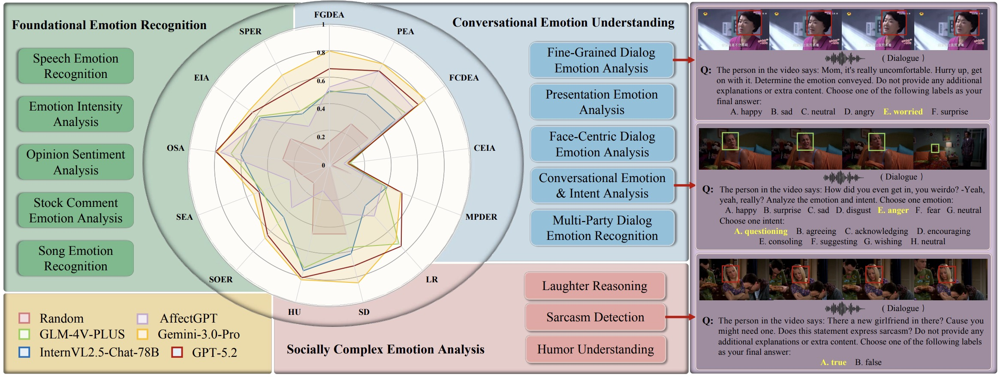

# EmoBench-M

<p align="center">
  
</p>

<p align="center">
    <a href="https://emo-gml.github.io/"></a>
    <a href="https://arxiv.org/pdf/2502.04424"></a>
    <a href="https://drive.google.com/file/d/1ohQWGJOuJVN3-uOeEifA3C0tMaadYe_K/view?usp=sharing"></a>
    <a href="https://opensource.org/licenses/Apache-2.0"> </a>

</p>

<p align="center">
    <a href="#-about">🌸 About</a> •
    <a href="#-news">📰 News</a> •
    <a href="#-leaderboard">🏆 Leaderboard</a> •
    <a href="#-dataset">📦 Dataset</a> •
    <a href="#-quick-start">🔥 Quick Start</a> •
    <a href="#-friendly-links">🔗 Friendly Links</a> •
    <a href="#-citation">📜 Citation</a>
</p>

## 🌸 About
This repository contains the official evaluation code and data for the paper "**EmoBench-M: Benchmarking Emotional Intelligence for Multimodal Large Language Models**". See more details in our [paper](https://arxiv.org/pdf/2502.04424). If you find this project helpful, feel free to ⭐ it!

> Can Multimodal Large Language Models (MLLMs) understand human emotions in dynamic, multimodal settings? To address this question, we introduce <b>EmoBench-M</b>, a comprehensive benchmark grounded in psychological theories of Emotional Intelligence (EI), designed to evaluate the EI capabilities of MLLMs across video, audio, and text. <b>EmoBench-M</b> spans 13 diverse scenarios across three key dimensions of EI: Foundational Emotion Recognition, Conversational Emotion Understanding, and Socially Complex Emotion Analysis. It includes over 5000 carefully curated samples and both classification and generation tasks, covering a wide range of real-world affective contexts. Through extensive evaluations of state-of-the-art MLLMs—including open-source models like Qwen2.5-VL and InternVL2.5, and proprietary models such as Gemini 2.0 Flash—we find that (i) current MLLMs significantly lag behind human performance, especially in conversational and socially complex tasks; (ii) model size alone does not guarantee better emotional reasoning; and (iii) nuanced social emotions and intent understanding remain particularly challenging. We hope EmoBench-M provides a solid foundation for future research toward emotionally intelligent AI systems.



## 📰 News
- **[2026-01-27]** The latest revision (v3) of our paper is available on arXiv.
- **[2025-08-25]** We released the second version (v2) of the paper on arXiv with substantial updates.
- **[2025-07-08]** We open-sourced the code and dataset for EmoBench-M on GitHub.
- **[2025-02-06]** The first version (v1) of the paper was submitted to arXiv.

## 🏆 Leaderboard

| Method                             |  FER  |  CEU  | SCEA | Avg. |
|------------------------------------|-------|-------|------|------|
| 🏅 Gemini-3.0-Pro                  | 69.3  | 62.3  | 80.0 | 70.5 |
| 🥈 GPT-5.2                         | 65.0  | 57.5  | 77.0 | 66.5 |
| 🥉 Gemini-3.0-Flash                | 62.0  | 56.2  | 78.4 | 65.5 |
| Gemini-2.0-Flash                   | 61.4  | 53.4  | 72.0 | 62.3 |
| Gemini-1.5-Flash                   | 59.7  | 55.6  | 68.6 | 61.3 |
| Gemini-2.0-Flash-Thinking          | 57.7  | 54.2  | 70.0 | 60.6 |
| Qwen3-VL-Instruct-8B               | 57.8  | 55.2  | 67.3 | 60.1 |
| Qwen2.5-VL-Instruct-72B            | 54.8  | 47.9  | 72.5 | 57.8 |
| GLM-4V-PLUS                        | 56.1  | 47.3  | 69.6 | 57.7 |
| Qwen2.5-VL-Instruct-32B            | 51.4  | 49.1  | 69.1 | 56.7 |
| InternVL2.5-38B                    | 57.6  | 48.9  | 56.6 | 54.4 |
| Qwen2.5-Omni-7B                    | 49.7  | 46.6  | 64.9 | 53.7 |
| Qwen2-Audio-7B-Instruct            | 59.9  | 43.3  | 55.7 | 53.0 |
| Qwen2.5-VL-Instruct-7B             | 51.7  | 43.7  | 63.2 | 52.9 |
| InternVL2.5-78B                    | 53.0  | 44.5  | 59.8 | 52.4 |
| Video-LLaMA2.1-7B-16F              | 50.9  | 46.1  | 57.5 | 51.5 |
| InternVideo2-Chat-8B               | 50.6  | 40.2  | 63.6 | 51.5 |
| InternVL2.5-4B                     | 54.5  | 49.3  | 49.0 | 50.9 |
| InternVL2.5-8B                     | 51.2  | 45.7  | 54.2 | 50.4 |
| Video-LLaMA2-72B                   | 50.7  | 37.3  | 61.8 | 49.9 |
| Video-LLaMA2.1-7B-AV               | 50.4  | 46.1  | 49.5 | 48.7 |
| Video-LLaMA2-7B                    | 45.4  | 34.5  | 61.3 | 47.1 |
| MiniCPM-V-2.6-8B                   | 40.0  | 43.1  | 56.5 | 46.5 |
| AffectGPT                          | 47.3  | 50.6  | 33.9 | 43.9 |
| LongVA-DPO-7B                      | 45.7  | 32.1  | 53.5 | 43.8 |
| Emotion-LLaMA                      | 36.9  | 30.7  | 54.1 | 40.6 |
| 👀 Random                          | 23.1  | 19.8  | 33.3 | 25.4 |


## 📦 Dataset
To use this benchmark, **please first download the original video files and corresponding annotation `.json` files** from the link below:

<a href="https://drive.google.com/file/d/1ohQWGJOuJVN3-uOeEifA3C0tMaadYe_K/view?usp=sharing"></a>

Each JSON file contains conversation-style prompts and labels aligned with the corresponding video clips. The structure looks like:

  ```json
  [
    {
      "id": "0",
      "video": "videos/ch-simsv2s/aqgy4_0004/00023.mp4",
      "conversations": [
        {
          "from": "human",
          "value": "<video>\nThe person in the video says: ... Determine the emotion conveyed..."
        },
        {
          "from": "gpt",
          "value": "negative"
        }
      ]
    }
  ]
  ```
  ### 📁 Dataset Structure
  ```bash
  EmoBench-M/
  ├── benchmark_json/           # JSON files containing metadata and annotations for each dataset
  │   ├── FGMSA.json    # Test instructions for the FGMSA dataset
  │   ├── MC-EIU.json           # 500-sample test set for the MC-EIU dataset
  │   ├── MELD.json     # Test instructions for the MELD dataset
  │   ├── MOSEI.json            # 500-sample test set for the MOSEI dataset
  │   ├── MOSI.json             # 500-sample test set for the MOSI dataset
  │   ├── MUSTARD.json               # 500-sample test set for the MUSTARD dataset
  │   ├── RAVDSS_song.json           # 500-sample test set for the RAVDSS song subset
  │   ├── RAVDSS_speech.json         # 500-sample test set for the RAVDSS speech subset
  │   ├── SIMS.json             # 500-sample test set for the SIMS dataset
  │   ├── ch-simsv2s.json       # 500-sample test set for the Chinese SIMS v2s dataset
  │   ├── funny.json    # Test instructions for the UR-FUNNY dataset
  │   ├── mer2023.json # Test instructions for the MER2023 dataset
  │   └── smile.json           # Test data for the SMILE dataset
  └── dataset/              # Corresponding video files for each dataset
      ├── FGMSA/
      │   └── videos/
      │       └── FGMSA/        # Video files for the FGMSA dataset
      ├── MC-EIU/
      │   └── videos/
      │       └── MC-EIU/       # Video files for the MC-EIU dataset
      ├── MELD/
      │   └── videos/
      │       └── MELD/         # Video files for the MELD dataset
      ├── MOSEI/
      │   └── videos/
      │       └── MOSEI/        # Video files for the MOSEI dataset
      ├── MOSI/
      │   └── videos/
      │       └── MOSI/         # Video files for the MOSI dataset
      ├── MUSTARD/
      │   └── videos/
      │       └── MUSTARD/      # Video files for the MUSTARD dataset
      ├── RAVDSS_song/
      │   └── videos/
      │       └── RAVDSS/       # Video files for the RAVDSS song subset
      ├── RAVDSS_speech/
      │   └── videos/
      │       └── RAVDSS/       # Video files for the RAVDSS speech subset
      ├── SIMS_test/
      │   └── videos/
      │       └── SIMS/         # Video files for the SIMS dataset
      ├── ch-simsv2s/
      │   └── videos/
      │       └── ch-simsv2s/   # Video files for the Chinese SIMS v2s dataset
      ├── funny/
      │   └── videos/
      │       └── UR-FUNNY/     # Video files for the UR-FUNNY dataset
      ├── mer2023/
      │   └── videos/
      │       └── MER2023/      # Video files for the MER2023 dataset
      └── smile/
          └── videos/
              └── SMILE/       # Video files for the SMILE dataset
  ```
  📂 Dtat Structure Overview
  - benchmark_json/: Contains JSON files with metadata and annotations for each dataset, including test instructions and sample information.
  - dataset/: Corresponding video files for each dataset, organized into subdirectories named after each dataset.

## 🔥 Quick Start
EmoBench-M encompasses three primary evaluation tasks: Classification, Joint Emotion + Intent, and Generation. Each dataset is associated with one of these tasks.

### 🧪 Evaluation Usage

#### Install Dependencies

```bash
pip install -r requirements.txt
```

#### 1. Classification
- **Task**: Classify videos into predefined emotional categories.
- **Command**:
  ```bash
  python eval.py classification --json results.json --output classification.json
  ```
- **Input JSON (e.g. results.json) Format**:
  ```json
  [
    {"video": "sample1.mp4", "expected_value": "positive", "predicted_value": "positive"},
    {"video": "sample2.mp4", "expected_value": "neutral", "predicted_value": "negative"}
  ]
  ```
- **Output Format**:
  ```json
  {
    "accuracy": 0.85,
    "precision": 0.84,
    "recall": 0.83,
    "f1_score": 0.83
  }
  ```
- **Applicable Datasets**: All datasets except MC-EIU.json and smile_test_data.json.
---

#### 2. Joint Emotion + Intent
- **Task**: Simultaneously predict the emotion and intent conveyed in a video.
- **Command**:
  ```bash
  python eval.py joint --json emotions.json --output joint.json
  ```
- **Input JSON (e.g. emotions.json) Format**:
  ```json
  [
    {
      "modal_path": "sample1.mp4",
      "expected_emotion": "happy",
      "predicted_emotion": "happy",
      "expected_intent": "encouraging",
      "predicted_intent": "encouraging"
    }
  ]
  ```
- **Output Format**:
  ```json
  {
    "joint_accuracy": 0.80,
    "joint_precision": 0.79,
    "joint_recall": 0.78,
    "joint_f1": 0.78,
    "total": 100
  }
  ```
- **Applicable Dataset**: MC-EIU.json.
---

#### 3. Generation
- **Task**: Generate a textual description of the video's content.
- **Command**:
  ```bash
  python eval.py generation --json gen.json --output generation.json
  ```
- **Input JSON (e.g. gen.json) Format**:
  ```json
  [
    {"video": "sample1.mp4", "prediction": "I am very happy", "reference": "I feel happy"}
  ]
  ```
- **Output Format**:
  ```json
  {
    "avg_bleu": 0.35,
    "avg_rouge": 0.42,
    "avg_bert": 0.75,
    "total": 100
  }
  ```
- **Applicable Dataset**: smile.json.
---

### Important Notes for Researchers and Developers
- **Input JSON Preparation**:
  
  Researchers and developers need to write scripts tailored to their trained or tested models to generate the aforementioned input JSON files (results.json, emotions.json, gen.json). This ensures that eval.py can correctly load and evaluate the data.

- **Evaluation Output**:
  
  Evaluation results will be saved in the specified output JSON files, facilitating further analysis and comparison of different model performances.

- **All-in-One Evaluation**:
  
  You can also use the all mode to run all three evaluations simultaneously. For example:
  ```bash
  python eval.py all \
    --classification-json results.json \
    --joint-json emotions.json \
    --generation-json gen.json \
    --output-dir results/
  ```
  This will generate three files: results/classification.json, results/joint.json, and results/generation.json, corresponding to the evaluation metrics of each task.


---

## 🔗 Friendly Links

- MUStARD — https://github.com/soujanyaporia/MUStARD (Multimodal Sarcasm Detection Dataset)
- MELD — https://github.com/declare-lab/MELD (Multimodal EmotionLines Dataset)
- CH-SIMS — https://github.com/thuiar/MMSA (Chinese Multimodal Sentiment Analysis)
- CH-SIMS v2.0 — https://github.com/thuiar/ch-sims-v2 (Enhanced CH-SIMS + AV-Mixup)
- UR-FUNNY — https://github.com/ROC-HCI/UR-FUNNY (Multimodal Humor Understanding)
- FMSA-SC — https://github.com/sunlitsong/FMSA-SC-dataset (Fine-grained Stock Comment Videos)
- SMILE — https://github.com/postech-ami/SMILE-Dataset (Understanding Laughter in Video)
- RAVDESS — https://zenodo.org/records/1188976 (Audio-Visual Emotional Speech & Song)
- MC-EIU — https://github.com/MC-EIU/MC-EIU (Emotion & Intent Joint Understanding)
- MER2023 — http://merchallenge.cn/datasets (Multimodal Emotion Recognition Challenge)
- EMER — https://github.com/zeroQiaoba/AffectGPT (Explainable Multimodal Emotion Reasoning)
- Emotion-LLaMA - https://github.com/ZebangCheng/Emotion-LLaMA （Multimodal Emotion Recognition and Reasoning）

## 📜 Citation
```bibtex
@article{hu2025emobench,
  title={EmoBench-M: Benchmarking Emotional Intelligence for Multimodal Large Language Models},
  author={Hu, He and Zhou, Yucheng and You, Lianzhong and Xu, Hongbo and Wang, Qianning and Lian, Zheng and Yu, Fei Richard and Ma, Fei and Cui, Laizhong},
  journal={arXiv preprint arXiv:2502.04424},
  year={2025}
  }
```

If you use the **EmoBench-M** or find any of the following datasets helpful for your research, please consider citing the corresponding papers:

```bibtex
@article{livingstone2018ryerson,
  title={The Ryerson Audio-Visual Database of Emotional Speech and Song (RAVDESS): A dynamic, multimodal set of facial and vocal expressions in North American English},
  author={Livingstone, Steven R and Russo, Frank A},
  journal={PloS one},
  volume={13},
  number={5},
  pages={e0196391},
  year={2018},
  publisher={Public Library of Science San Francisco, CA USA}
}

@article{zadeh2016mosi,
  title={Mosi: multimodal corpus of sentiment intensity and subjectivity analysis in online opinion videos},
  author={Zadeh, Amir and Zellers, Rowan and Pincus, Eli and Morency, Louis-Philippe},
  journal={arXiv preprint arXiv:1606.06259},
  year={2016}
}

@inproceedings{zadeh2018multimodal,
  title={Multimodal language analysis in the wild: Cmu-mosei dataset and interpretable dynamic fusion graph},
  author={Zadeh, AmirAli Bagher and Liang, Paul Pu and Poria, Soujanya and Cambria, Erik and Morency, Louis-Philippe},
  booktitle={Proceedings of the 56th Annual Meeting of the Association for Computational Linguistics (Volume 1: Long Papers)},
  pages={2236--2246},
  year={2018}
}

@article{song2024fmsa,
  title={FMSA-SC: A fine-grained multimodal sentiment analysis dataset based on stock comment videos},
  author={Song, Lingyun and Chen, Siyu and Meng, Ziyang and Sun, Mingxuan and Shang, Xuequn},
  journal={IEEE Transactions on Multimedia},
  volume={26},
  pages={7294--7306},
  year={2024},
  publisher={IEEE}
}

@inproceedings{lian2023mer,
  title={Mer 2023: Multi-label learning, modality robustness, and semi-supervised learning},
  author={Lian, Zheng and Sun, Haiyang and Sun, Licai and Chen, Kang and Xu, Mngyu and Wang, Kexin and Xu, Ke and He, Yu and Li, Ying and Zhao, Jinming and others},
  booktitle={Proceedings of the 31st ACM international conference on multimedia},
  pages={9610--9614},
  year={2023}
}

@inproceedings{liu2022make,
  title={Make acoustic and visual cues matter: Ch-sims v2. 0 dataset and av-mixup consistent module},
  author={Liu, Yihe and Yuan, Ziqi and Mao, Huisheng and Liang, Zhiyun and Yang, Wanqiuyue and Qiu, Yuanzhe and Cheng, Tie and Li, Xiaoteng and Xu, Hua and Gao, Kai},
  booktitle={Proceedings of the 2022 international conference on multimodal interaction},
  pages={247--258},
  year={2022}
}

@inproceedings{yu2020ch,
  title={Ch-sims: A chinese multimodal sentiment analysis dataset with fine-grained annotation of modality},
  author={Yu, Wenmeng and Xu, Hua and Meng, Fanyang and Zhu, Yilin and Ma, Yixiao and Wu, Jiele and Zou, Jiyun and Yang, Kaicheng},
  booktitle={Proceedings of the 58th annual meeting of the association for computational linguistics},
  pages={3718--3727},
  year={2020}
}

@article{liu2024emotion,
  title={Emotion and intent joint understanding in multimodal conversation: A benchmarking dataset},
  author={Liu, Rui and Zuo, Haolin and Lian, Zheng and Xing, Xiaofen and Schuller, Bj{\"o}rn W and Li, Haizhou},
  journal={arXiv preprint arXiv:2407.02751},
  year={2024}
}

@article{poria2018meld,
  title={Meld: A multimodal multi-party dataset for emotion recognition in conversations},
  author={Poria, Soujanya and Hazarika, Devamanyu and Majumder, Navonil and Naik, Gautam and Cambria, Erik and Mihalcea, Rada},
  journal={arXiv preprint arXiv:1810.02508},
  year={2018}
}

@article{castro2019towards,
  title={Towards multimodal sarcasm detection (an \_obviously\_ perfect paper)},
  author={Castro, Santiago and Hazarika, Devamanyu and P{\'e}rez-Rosas, Ver{\'o}nica and Zimmermann, Roger and Mihalcea, Rada and Poria, Soujanya},
  journal={arXiv preprint arXiv:1906.01815},
  year={2019}
}

@article{hasan2019ur,
  title={UR-FUNNY: A multimodal language dataset for understanding humor},
  author={Hasan, Md Kamrul and Rahman, Wasifur and Zadeh, Amir and Zhong, Jianyuan and Tanveer, Md Iftekhar and Morency, Louis-Philippe and others},
  journal={arXiv preprint arXiv:1904.06618},
  year={2019}
}

@article{hyun2023smile,
  title={Smile: Multimodal dataset for understanding laughter in video with language models},
  author={Hyun, Lee and Sung-Bin, Kim and Han, Seungju and Yu, Youngjae and Oh, Tae-Hyun},
  journal={arXiv preprint arXiv:2312.09818},
  year={2023}
}


